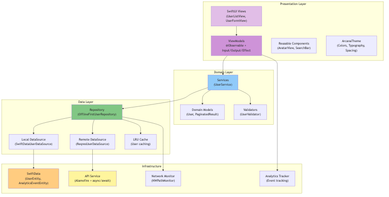
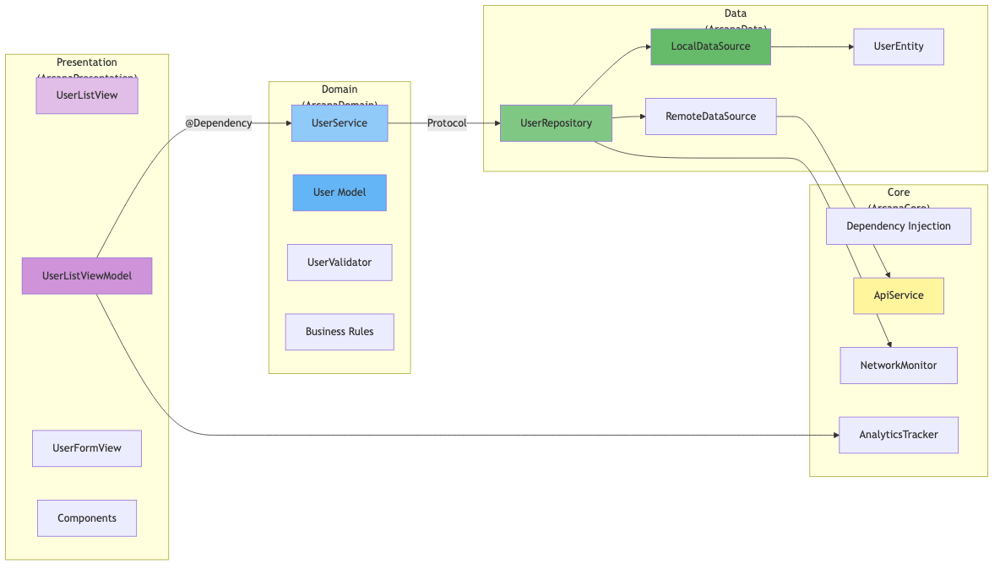
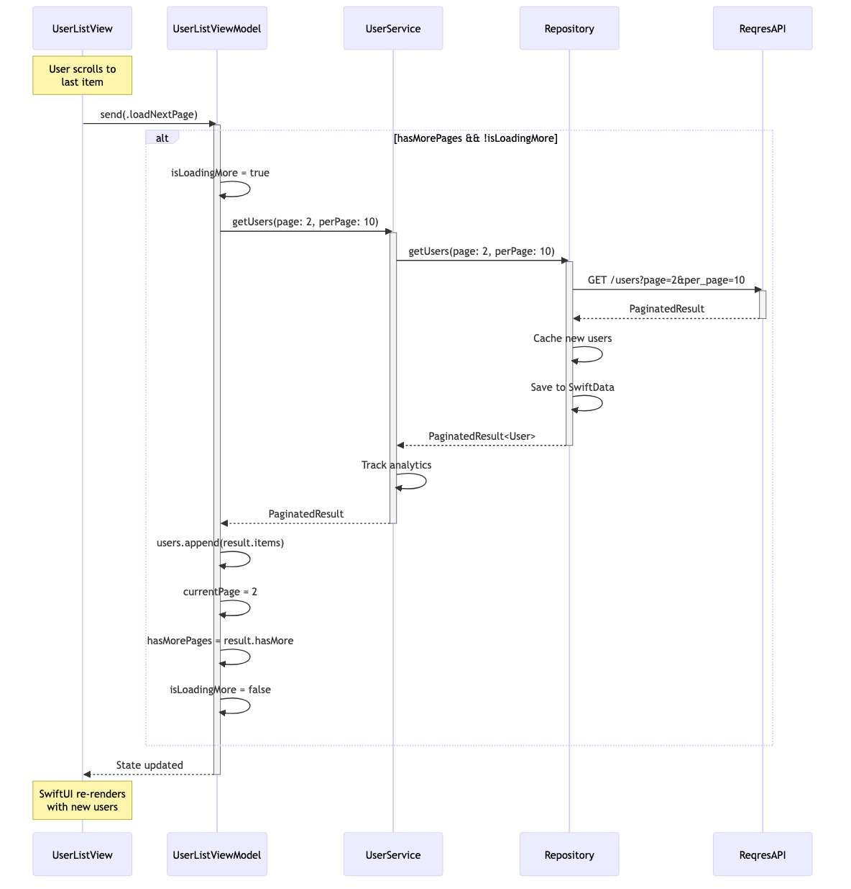
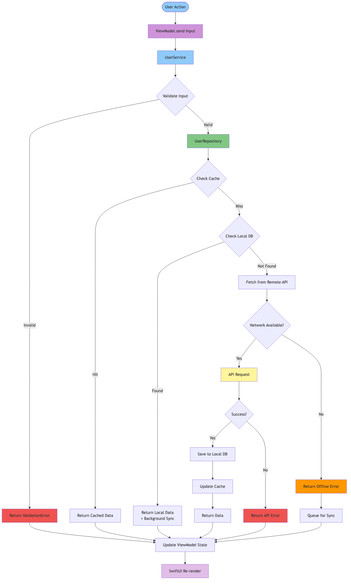
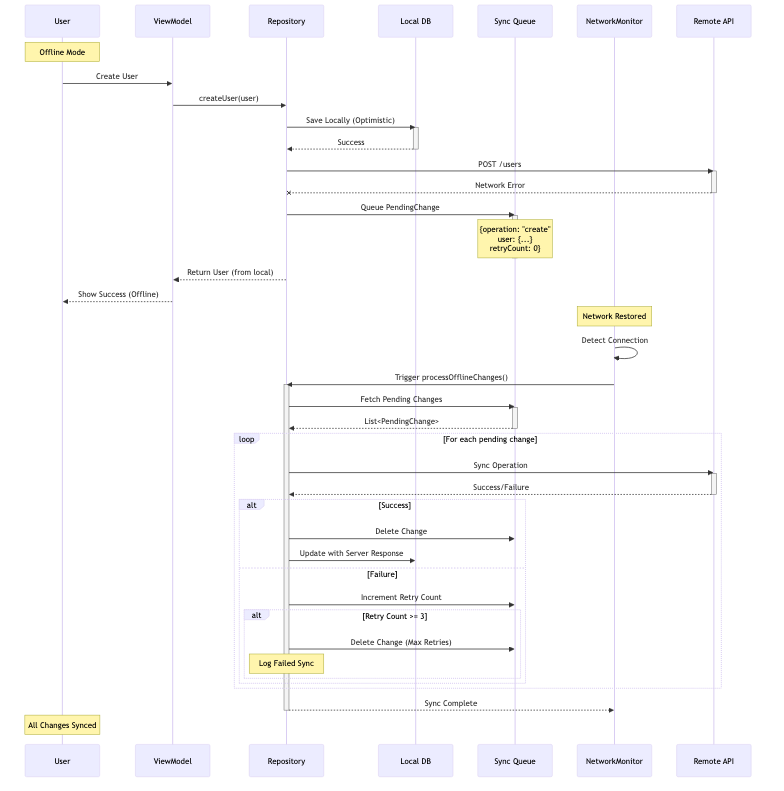
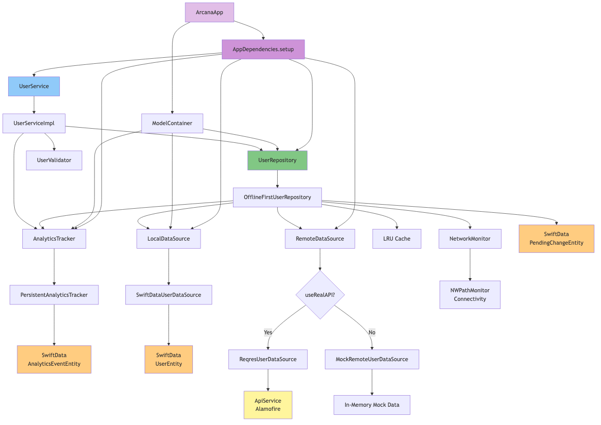

# Arcana iOS

> A modern iOS application demonstrating **Clean Architecture**, **Offline-First** design, and **Analytics Tracking** with SwiftUI.

[](ARCHITECTURE_EVALUATION_V3.md)
[](ARCHITECTURE_EVALUATION_V3.md)
[](ARCHITECTURE_EVALUATION_V3.md)
[](https://swift.org)
[](https://developer.apple.com/xcode/swiftui/)
[](https://blog.cleancoder.com/uncle-bob/2012/08/13/the-clean-architecture.html)
[](LICENSE)

<!-- agent-managed badges START -->
<p align="center">
  <a href="https://arcana.boo/sonarqube/dashboard?id=ios-app"></a>
  <a href="https://arcana.boo/jenkins/job/ios-app-mb/job/main/"></a>
</p>
<!-- agent-managed badges END -->

---

## 📋 Table of Contents

- [Highlights](#-highlights)
- [Features](#-features)
- [Architecture](#-architecture)
  - [High-Level Architecture](#high-level-architecture)
  - [Key Architectural Patterns](#key-architectural-patterns)
  - [View Architecture Diagrams](#-view-architecture-diagrams)
- [Input Validation](#-input-validation)
- [Technology Stack](#-technology-stack)
- [Getting Started](#-getting-started)
- [Documentation](#-documentation)
- [Project Structure](#-project-structure)
- [Building](#-building)
- [Testing](#-testing)
- [Analytics](#-analytics)
- [Contributing](#-contributing)
- [License](#-license)

---

## 🎯 Highlights

### 🚀 Latest Features

- **📊 Pagination with Lazy Loading** - Efficient data loading with infinite scroll (10 items per page)
- **📱 Real-time Statistics Banner** - Shows total users loaded and page progress
- **🔍 Swift 6 Concurrency** - Full async/await with actor isolation and Sendable conformance
- **📝 Swift Package Manager** - Modular architecture with SPM framework
- **✅ SwiftUI Observation API** - Modern @Observable macro replacing Combine
- **🎨 Modern Arcana Theme** - Professional purple gradient with mystical aesthetic

---

## ✨ Features

### Core Functionality
- ✅ **User Management** - Create, Read, Update, Delete operations
- ✅ **Offline-First** - Full functionality without internet connection
- ✅ **Auto-Sync** - Background synchronization when online
- ✅ **Smart Caching** - LRU cache for optimal performance
- ✅ **Pagination** - Efficient lazy loading with page navigation (10 items/page)
- ✅ **Real-time Updates** - Reactive UI with SwiftUI Observation

### Advanced Features
- 📊 **Analytics Tracking** - Comprehensive user behavior tracking with SwiftData
- 🔄 **Background Sync** - Automatic sync when network restored
- 📱 **Modern UI** - Beautiful SwiftUI interface with Arcana theme
- ✅ **Input Validation** - Real-time form validation with user-friendly errors
- 🎯 **Type-Safe Navigation** - SwiftUI NavigationStack
- 💾 **Persistent Storage** - SwiftData framework
- 🌐 **RESTful API** - Alamofire + async/await
- 🔍 **Network Logging** - Configurable request/response logging with JSON formatting
- 🏗️ **MVVM + UDF** - Unidirectional Data Flow with Input/Output/Effect pattern
- 🌍 **Internationalization** - Multi-language support (English, Chinese)
- ⚙️ **Configuration Management** - Environment-specific configs with .plist files
- 🏗️ **Architecture Compliance** - 67 automated rules validating Clean Architecture, Swift.org API Design, and Google Swift Style
- 📝 **Comprehensive Documentation** - Auto-generated API docs and architecture diagrams

---

## 🏗 Architecture

This application follows **Clean Architecture** principles with clear separation of concerns across three main layers:

### High-Level Architecture

```
┌─────────────────────────────────────────────────────────────┐
│                     Presentation Layer                      │
│  ┌──────────────┐  ┌──────────────┐  ┌──────────────┐       │
│  │    SwiftUI   │→ │  ViewModels  │→ │  UI States   │       │
│  │     Views    │  │    (MVVM)    │  │              │       │
│  └──────┬───────┘  └──────────────┘  └──────────────┘       │
│         ↓                                                   │
│  ┌──────────────┐                                           │
│  │  Validation  │                                           │
│  │  & Components│                                           │
│  └──────────────┘                                           │
└────────────────────────┬────────────────────────────────────┘
                         ↓
┌─────────────────────────────────────────────────────────────┐
│                      Domain Layer                           │
│  ┌──────────────┐  ┌──────────────┐  ┌──────────────┐       │
│  │   Services   │→ │Business Logic│→ │Domain Models │       │
│  │              │  │              │  │              │       │
│  └──────────────┘  └──────────────┘  └──────────────┘       │
└────────────────────────┬────────────────────────────────────┘
                         ↓
┌─────────────────────────────────────────────────────────────┐
│                       Data Layer                            │
│  ┌──────────────┐  ┌──────────────┐  ┌──────────────┐       │
│  │ Repository   │→ │  SwiftData   │  │  Remote API  │       │
│  │(Offline-1st) │  │   (Local)    │  │  (Alamofire) │       │
│  └──────────────┘  └──────────────┘  └──────────────┘       │
└─────────────────────────────────────────────────────────────┘
```

### Key Architectural Patterns

#### 1. **Offline-First Strategy**
```
User Action
    ├─ Online  → API → Update Local → Cache → UI
    └─ Offline → Local → Queue Change → Optimistic UI
                    ↓
            Background Sync (When Online)
                    ↓
            Apply Queued Changes → API → Sync
```

#### 2. **Unidirectional Data Flow + Effect Management**

This app implements **Unidirectional Data Flow (UDF)** architecture with explicit effect management, ensuring predictable state changes and clear separation of concerns.

**Architectural Principles:**
```
UI Events → ViewModel → State Update → UI Render
   ↓           ↓            ↓            ↓
(User      (Process)   (Mutate)    (Display)
 Action)

Side Effects (Navigation, Alerts, Analytics)
     ↓
Handled separately from state
```

**Implementation: Input/Output/Effect Pattern**

We use the **Input/Output/Effect** pattern as our concrete implementation of UDF + Effect Management:

```swift
@MainActor
@Observable
final class UserListViewModel {

    // Input - User actions from the View
    enum Input {
        case loadInitial
        case loadNextPage
        case refresh
        case selectUser(User)
        case deleteUser(User)
    }

    // Output - Observable state for UI rendering
    struct Output {
        var users: [User] = []
        var isLoading: Bool = false
        var currentPage: Int = 1
        var totalPages: Int = 1
        var hasMorePages: Bool = false
    }

    // Effect - Side effects (Navigation, Alerts, etc.)
    enum Effect {
        case showError(AppError)
        case showSuccess(String)
        case navigateToDetail(User)
    }

    // Observable state accessible to View
    private(set) var output = Output()

    // Single entry point - processes input actions
    func input(_ action: Input) async -> Effect? {
        switch action {
        case .loadInitial:
            return await loadUsers()
        case .selectUser(let user):
            return .navigateToDetail(user)
        }
    }
}

// View usage
Button("Load") {
    Task {
        if let effect = await viewModel.input(.loadInitial) {
            handleEffect(effect)  // Handle navigation, alerts, etc.
        }
    }
}
Text("\(viewModel.output.users.count) users")
```

**Architecture Rating: 9.5/10** ⭐⭐⭐⭐⭐
- **Status:** ✅ Production Ready
- **Evaluation:** [Architecture Evaluation v3.0](ARCHITECTURE_EVALUATION_V3.md)

**Key Benefits:**
- ✅ **100% Consistent** - All ViewModels follow identical pattern
- ✅ **Perfect Encapsulation** - State wrapped in Output struct
- ✅ **Clear Naming** - `input()` and `output` communicate purpose
- ✅ **Structured Concurrency** - Native async/await, no unstructured Tasks
- ✅ **Enforced Effect Handling** - Effects returned, not published
- ✅ **Type-Safe** - Compiler-enforced action and effect types
- ✅ **Testable** - Easy to snapshot state and verify effects
- ✅ **Modern Swift** - @Observable, async/await, swift-dependencies

**Alternative Implementations:** Redux/TCA, MVI, Elm Architecture all implement the same UDF + Effect Management principles with different APIs.

📖 See [ViewModel Pattern Documentation](docs/VIEWMODEL_PATTERN.md) for detailed implementation.

#### 3. **Pagination with Lazy Loading**
```swift
// Trigger pagination when last item appears
.onAppear {
    if user.id == viewModel.displayedUsers.last?.id {
        viewModel.send(.loadNextPage)
    }
}

// Statistics Banner
UserStatisticsBanner(
    totalUsersLoaded: viewModel.users.count,
    currentPage: viewModel.currentPage,
    totalPages: viewModel.totalPages
)
```

#### 4. **Analytics Tracking**
```swift
@MainActor
@Observable
final class ViewModel {
    @Dependency(\.analyticsTracker) var analyticsTracker

    func loadData() async {
        analyticsTracker.trackEvent(.pageLoaded, params: [
            "screen": "user_list",
            "page": currentPage
        ])
    }
}
```

#### 5. **Cache Management**
- **LRU Cache** with configurable size (nicklockwood/LRUCache)
- **Thread-safe** cache access
- **Automatic cleanup** of stale entries
- **Background sync** for cache updates

#### 6. **Arcana UI Theme**
- **Purple Gradient** backgrounds with mystical aesthetic
- **Gold & Violet Accents** for interactive elements
- **Custom Typography** with SF Pro
- **Responsive Design** with Dark/Light mode support

### 📊 View Architecture Diagrams

Comprehensive architecture diagrams are available below:

#### 1. Overall Architecture



*[View Mermaid Source](docs/architecture/01-overall-architecture.mmd)*

---

#### 2. Clean Architecture Layers



*[View Mermaid Source](docs/architecture/02-clean-architecture-layers.mmd)*

---

#### 3. Pagination System



*[View Mermaid Source](docs/architecture/03-pagination-system.mmd)*

---

#### 4. Data Flow



*[View Mermaid Source](docs/architecture/04-data-flow.mmd)*

---

#### 5. Offline-First Sync



*[View Mermaid Source](docs/architecture/05-offline-first-sync.mmd)*

---

#### 6. Dependency Graph



*[View Mermaid Source](docs/architecture/06-dependency-graph.mmd)*

---

#### 🔧 Regenerate Diagrams

To regenerate PNG diagrams from Mermaid source files:

```bash
# Install mermaid-cli (if not already installed)
npm install -g @mermaid-js/mermaid-cli

# Generate all diagrams
for file in docs/architecture/*.mmd; do
  filename=$(basename "$file" .mmd)
  mmdc -i "$file" -o "docs/diagrams/${filename}.png" -b transparent -w 1200
done
```

#### Detailed Documentation
📖 Read the complete [Architecture Documentation](docs/ARCHITECTURE.md)

---

## ✅ Input Validation

This application implements **production-ready input validation** following Apple's SwiftUI best practices:

### Key Features

#### ✨ Real-time Validation
- Validation runs automatically as the user types
- Uses `@Observable` for efficient state management
- No manual validation triggers needed

#### 🎯 User-Friendly Error Display
- Errors shown only after user interacts with field
- Clear, specific error messages
- Visual indicators (red outline) on invalid fields
- Supporting text below each field for guidance

#### 🔒 Validation Rules

| Field | Rules | Error Messages |
|-------|-------|----------------|
| **First Name** | Required, max 100 chars | "First name is required"<br>"First name is too long (max 100 characters)" |
| **Last Name** | Required, max 100 chars | "Last name is required"<br>"Last name is too long (max 100 characters)" |
| **Email** | Required, RFC-compliant format | "Email is required"<br>"Invalid email address format"<br>"Email address is too long" |
| **Avatar** | Valid URL | "Invalid avatar URL" |

### Implementation Pattern

```swift
@MainActor
@Observable
final class UserFormViewModel {
    enum Input {
        case updateFirstName(String)
        case updateEmail(String)
        case submit
        case validateAll
    }

    struct Output {
        var firstName: String = ""
        var email: String = ""
        var firstNameError: String?
        var emailError: String?
        var isValid: Bool = false
    }

    private(set) var state = Output()

    func send(_ input: Input) {
        switch input {
        case .updateFirstName(let value):
            state.firstName = value
            validateFirstName()

        case .validateAll:
            validateAll()

        case .submit:
            if state.isValid {
                createUser()
            }
        }
    }

    private func validateFirstName() {
        if case .failure(let error) = UserValidator.validateName(state.firstName) {
            state.firstNameError = error.message
        } else {
            state.firstNameError = nil
        }
        updateFormValidity()
    }
}
```

### SwiftUI Integration

```swift
struct UserFormView: View {
    @State private var viewModel: UserFormViewModel

    var body: some View {
        Form {
            TextField("First Name", text: Binding(
                get: { viewModel.state.firstName },
                set: { viewModel.send(.updateFirstName($0)) }
            ))
            .textFieldStyle(.roundedBorder)
            if let error = viewModel.state.firstNameError {
                Text(error)
                    .font(.caption)
                    .foregroundColor(.red)
            }

            Button("Create User") {
                viewModel.send(.submit)
            }
            .disabled(!viewModel.state.isValid)
        }
    }
}
```

### Apple Best Practices Followed

- ✅ **Validate as the user types** - Real-time validation with @Observable
- ✅ **Separate validation state from UI** - Validation logic in ViewModel
- ✅ **Use native TextField features** - Error messages and visual feedback
- ✅ **Track user interaction** - Validation after first interaction
- ✅ **Accessibility** - VoiceOver announces error states

📖 See [UserFormView Input Validation Documentation](docs/USER_FORM_VALIDATION.md) for detailed implementation.

---

## 🛠 Technology Stack

### Core Technologies
| Category | Technology | Purpose |
|----------|-----------|---------|
| **Language** | Swift 6.0+ | Modern, safe, performant |
| **UI Framework** | SwiftUI | Declarative UI |
| **Architecture** | Clean Architecture + MVVM | Maintainable, testable |
| **Async** | async/await + Actors | Concurrency safety |
| **DI** | swift-dependencies | Dependency injection |

### Data Layer
| Category | Technology | Purpose |
|----------|-----------|---------|
| **Local DB** | SwiftData | Modern persistence |
| **HTTP Client** | Alamofire | Networking |
| **Serialization** | Codable | JSON parsing |
| **Caching** | LRUCache | Performance optimization |

### Infrastructure
| Category | Technology | Purpose |
|----------|-----------|---------|
| **Network Monitoring** | NWPathMonitor | Connectivity detection |
| **Network Logging** | Alamofire EventMonitor | Request/response logging |
| **Navigation** | NavigationStack | Type-safe navigation |
| **Analytics** | SwiftData | Event tracking |
| **Package Manager** | SPM | Dependency management |

### Testing
| Category | Technology | Purpose |
|----------|-----------|---------|
| **Unit Tests** | XCTest | Test framework |
| **UI Tests** | SwiftUI Testing | View testing |
| **Async Testing** | XCTest async | Concurrency testing |

### Documentation
| Category | Technology | Purpose |
|----------|-----------|---------|
| **API Docs** | DocC | Swift documentation |
| **Diagrams** | Mermaid | Architecture diagrams |
| **Build** | Xcode | Build automation |

---

## 🚀 Getting Started

### Prerequisites

- **Xcode** 16.0 or later
- **iOS** 18.0+ deployment target
- **Swift** 6.0+
- **CocoaPods** or **Swift Package Manager**

### Quick Start

1. **Clone the repository**
   ```bash
   git clone https://github.com/yourusername/arcana-ios.git
   cd arcana-ios
   ```

2. **Open in Xcode**
   ```bash
   open arcana-ios.xcodeproj
   ```

3. **Install dependencies**
   ```bash
   # SPM dependencies are resolved automatically
   # Or manually: File → Packages → Resolve Package Versions
   ```

4. **Run the app**
   - Select target: `arcana-ios`
   - Select simulator: iPhone 17
   - Press `⌘ + R`

5. **Run tests**
   ```bash
   xcodebuild -project arcana-ios.xcodeproj -scheme arcana-ios -destination 'platform=iOS Simulator,name=iPhone 17' test
   # or
   # Press ⌘ + U in Xcode
   ```

### Configuration

The app uses environment-specific configuration files for all settings including API, logging, analytics, and feature flags.

#### Environment Configuration Files

- **Config.plist** - Base configuration (shared settings)
- **Config-Development.plist** - Development environment (verbose logging enabled)
- **Config-Staging.plist** - Staging environment (info-level logging)
- **Config-Production.plist** - Production environment (logging disabled)

#### Network Logging

The app includes a **NetworkLogger** that integrates with Alamofire to log all HTTP requests and responses. Logging can be controlled via configuration:

```xml
<!-- Config-Development.plist -->
<key>Logging</key>
<dict>
    <key>Enabled</key>
    <true/>
    <key>LogHeaders</key>
    <true/>
    <key>LogBody</key>
    <true/>
    <key>LogLevel</key>
    <string>verbose</string>
</dict>
```

**Features:**
- Logs request URL, method, headers, and JSON body
- Logs response status, headers, body, and duration
- Pretty-prints JSON for readability
- Automatically redacts sensitive headers (Authorization, API keys, cookies)
- Supports multiple log levels: verbose, info, error, none
- Environment-specific settings (enabled in dev, disabled in production)
- Uses OSLog for system integration

**Example Output:**
```
🚀 REQUEST
├─ URL: https://reqres.in/api/users?page=1
├─ Method: GET
├─ Headers:
│  ├─ Content-Type: application/json
│  ├─ x-api-key: ***REDACTED***
└─ Body: None

📥 RESPONSE ✅
├─ URL: https://reqres.in/api/users?page=1
├─ Status Code: 200 ✅
├─ Duration: 0.342s
└─ Body:
{
  "page": 1,
  "per_page": 6,
  "data": [...]
}
```

See `arcana-ios/Sources/ArcanaCore/Network/NetworkLogger.swift` for implementation details.

---

## 📚 Documentation

### Generated Documentation

All documentation is **automatically generated** and available in the `docs/` directory:

#### API Documentation
```bash
# Generate API docs:
xcodebuild docbuild -scheme arcana-ios -destination 'platform=iOS Simulator,name=iPhone 17'

# View API docs:
open .build/documentation/index.html
```

#### Architecture Diagrams
```bash
# Generate PNG diagrams:
npm run generate-diagrams

# View diagrams:
open docs/diagrams/
```

### Manual Documentation

- 📖 [Architecture Guide](docs/ARCHITECTURE.md) - Comprehensive architecture documentation
- 🏗️ [ViewModel Pattern](docs/VIEWMODEL_PATTERN.md) - Input/Output/Effect pattern guide
- ✅ [Input Validation](docs/USER_FORM_VALIDATION.md) - Form validation implementation
- 🎨 [Mermaid Diagrams](docs/architecture/) - Source diagrams
- 📊 [Pagination Guide](docs/PAGINATION.md) - Lazy loading implementation
- ⚙️ [Configuration Guide](CONFIGURATION_GUIDE.md) - Environment-specific configuration management
- 🌍 [Internationalization Guide](I18N_GUIDE.md) - Multi-language support
- 🏗️ [Architecture Compliance](ARCHITECTURE_COMPLIANCE.md) - 67 automated rules (Clean Architecture, Swift.org API Design, Google Swift Style)
- 📝 [Configuration Migration](CONFIGURATION_MIGRATION.md) - Hardcoded values migration report
- ♿ [Accessibility Identifiers](ACCESSIBILITY_IDENTIFIERS.md) - UI testing accessibility guide
- 🎯 [Architecture Evaluation](ARCHITECTURE_EVALUATION.md) - Comprehensive pros/cons analysis of the architecture

---

## 📁 Project Structure

```
arcana-ios/
├── arcana-ios/
│   └── Sources/
│       ├── ArcanaCore/                # Core framework
│       │   ├── DI/                   # Dependency injection
│       │   ├── Network/              # Network monitoring
│       │   └── Remote/               # API services
│       │
│       ├── ArcanaDomain/             # Business logic
│       │   ├── Model/                # Domain models
│       │   ├── Service/              # Domain services
│       │   └── Validation/           # Input validators
│       │
│       ├── ArcanaData/               # Data layer
│       │   ├── Local/                # SwiftData entities
│       │   ├── Remote/               # API data sources
│       │   └── Repository/           # Repository implementations
│       │
│       └── ArcanaPresentation/       # UI layer
│           ├── Screens/              # Views + ViewModels
│           ├── Components/           # Reusable components
│           └── Theme/                # UI theming
│
├── docs/                             # Documentation
│   ├── api/                          # API documentation
│   ├── architecture/                 # Mermaid diagram sources
│   ├── diagrams/                     # Generated PNG diagrams
│   └── ARCHITECTURE.md               # Architecture guide
│
├── arcana-ios.xcodeproj/            # Xcode project
└── README.md                         # This file
```

### Key Directories Explained

| Directory | Purpose |
|-----------|---------|
| `ArcanaCore/` | Core framework with DI and networking |
| `ArcanaDomain/` | Business logic (zero UIKit/SwiftUI dependencies) |
| `ArcanaData/` | Data layer with repositories and data sources |
| `ArcanaPresentation/` | SwiftUI views and ViewModels |
| `docs/` | Auto-generated documentation and diagrams |

---

## 🔨 Building

### Build Variants

```bash
# Debug build (with logging)
xcodebuild -project arcana-ios.xcodeproj -scheme arcana-ios -configuration Debug

# Release build (optimized)
xcodebuild -project arcana-ios.xcodeproj -scheme arcana-ios -configuration Release
```

### Build Outputs

| Task | Output Location |
|------|----------------|
| Debug Build | `build/Debug-iphonesimulator/arcana-ios.app` |
| Release Build | `build/Release-iphoneos/arcana-ios.app` |
| Test Results | `build/Logs/Test/` |

### Xcode Tasks

```bash
# Clean build
xcodebuild clean -project arcana-ios.xcodeproj -scheme arcana-ios

# Build
xcodebuild build -project arcana-ios.xcodeproj -scheme arcana-ios

# Test
xcodebuild test -project arcana-ios.xcodeproj -scheme arcana-ios \
  -destination 'platform=iOS Simulator,name=iPhone 17'

# Archive
xcodebuild archive -project arcana-ios.xcodeproj -scheme arcana-ios \
  -archivePath build/arcana-ios.xcarchive
```

---

## 🧪 Testing

### Automated Testing & Coverage

📊 **[View Interactive Test Coverage Report](docs/test-coverage.html)** | 📄 **[Detailed Coverage Analysis](COVERAGE_ANALYSIS.md)** | 📋 **[Testing Guide](TESTING.md)**

The project includes **automated test execution and coverage report generation** with a simple Makefile:

#### Quick Start

```bash
# Run all tests with coverage and auto-generate HTML report
make test

# Run only unit tests
make test-unit

# Run only UI tests
make test-ui

# Generate coverage report from latest test run
make coverage
```

After running tests, an **interactive HTML coverage report** is automatically generated at `docs/test-coverage.html` with:
- 🎨 Color-coded coverage visualization
- 📊 File-by-file breakdown
- 📈 Overall statistics
- 🔍 Sortable tables

#### Coverage Summary
- **Overall**: 26.42% (2,540 / 9,614 lines)
- **Unit Tests**: 94.84% coverage (arcana-iosTests)
- **UI Tests**: 100% coverage (arcana-iosUITests)
- **Domain Layer**: ~90% (User, UserValidator)
- **ViewModels**: ~90% (MainViewModel, UserListViewModel, UserFormViewModel)
- **Test Status**: ✅ All tests passing

See [COVERAGE_ANALYSIS.md](COVERAGE_ANALYSIS.md) for detailed recommendations on improving coverage.

### Test Structure

```
arcana-iosTests/
├── Domain/
│   ├── UserTests.swift (20+ tests)
│   ├── UserValidatorTests.swift (25+ tests)
│   └── UserServiceImplTests.swift (20+ tests)
├── Core/
│   ├── AppErrorTests.swift (25+ tests)
│   └── AnalyticsTests.swift (15+ tests)
├── Mocks/
│   ├── MockAnalyticsTracker.swift
│   └── MockUserRepository.swift
└── ComprehensiveCoverageTests.swift (30+ tests)
```

### Testing Highlights

- ✅ **Domain Model Tests** - Comprehensive User model testing (Codable, Hashable, DTO)
- ✅ **Validation Tests** - Email, name, and full user validation with edge cases
- ✅ **Service Tests** - Business logic with analytics tracking verification
- ✅ **Error Handling** - All error types, URLError conversion, HTTP mapping
- ✅ **Mock Implementations** - High-quality test doubles for dependencies
- ✅ **Edge Cases** - Unicode, boundaries, empty values, pagination limits
- ✅ **Async Tests** - Proper async/await testing with Swift 6 concurrency

---

## 📊 Analytics

This app includes a **production-ready analytics system** using SwiftData:

### Features

- ✅ **Event Tracking** - Screen views, user actions, errors
- ✅ **Performance Metrics** - Page load times, operation duration
- ✅ **Error Tracking** - Comprehensive error logging with context
- ✅ **Offline Support** - Events persisted locally with SwiftData
- ✅ **Session Tracking** - User session management

### Usage Example

```swift
@MainActor
@Observable
final class UserListViewModel {
    @Dependency(\.analyticsTracker) var analyticsTracker

    func send(_ input: Input) {
        switch input {
        case .loadInitial:
            analyticsTracker.trackScreen("User List")
            await loadUsers()

        case .selectUser(let user):
            analyticsTracker.trackEvent(.userSelected, params: [
                "userId": user.id,
                "email": user.email
            ])
        }
    }

    private func loadUsers() async {
        do {
            let users = try await userService.getUsers()
            analyticsTracker.trackEvent(.pageLoaded, params: [
                "count": users.count
            ])
        } catch {
            analyticsTracker.trackError(error)
        }
    }
}
```

### Architecture

```
ViewModels
    ↓
PersistentAnalyticsTracker
    ↓
SwiftData (Local Storage)
    ↓
Background Sync (when online)
    ↓
Analytics API
```

---

## 🤝 Contributing

Contributions are welcome! Please follow these guidelines:

### Setup Development Environment

1. Fork the repository
2. Create a feature branch: `git checkout -b feature/amazing-feature`
3. Follow the existing code style
4. Write/update tests
5. Update documentation
6. Commit changes: `git commit -m 'Add amazing feature'`
7. Push to branch: `git push origin feature/amazing-feature`
8. Open a Pull Request

### Code Style

- Follow [Swift API Design Guidelines](https://www.swift.org/documentation/api-design-guidelines/)
- Use meaningful variable/function names
- Add documentation comments for public APIs
- Keep functions small and focused
- Write tests for new features
- Use Swift 6 strict concurrency

### Pull Request Checklist

- [ ] Code follows project style
- [ ] Tests pass
- [ ] New tests added for new features
- [ ] Documentation updated
- [ ] No build warnings
- [ ] Swift 6 concurrency compliance

---

## 📄 License

```
MIT License

Copyright (c) 2024 Arcana Project

Permission is hereby granted, free of charge, to any person obtaining a copy
of this software and associated documentation files (the "Software"), to deal
in the Software without restriction, including without limitation the rights
to use, copy, modify, merge, publish, distribute, sublicense, and/or sell
copies of the Software, and to permit persons to whom the Software is
furnished to do so, subject to the following conditions:

The above copyright notice and this permission notice shall be included in all
copies or substantial portions of the Software.

THE SOFTWARE IS PROVIDED "AS IS", WITHOUT WARRANTY OF ANY KIND, EXPRESS OR
IMPLIED, INCLUDING BUT NOT LIMITED TO THE WARRANTIES OF MERCHANTABILITY,
FITNESS FOR A PARTICULAR PURPOSE AND NONINFRINGEMENT. IN NO EVENT SHALL THE
AUTHORS OR COPYRIGHT HOLDERS BE LIABLE FOR ANY CLAIM, DAMAGES OR OTHER
LIABILITY, WHETHER IN AN ACTION OF CONTRACT, TORT OR OTHERWISE, ARISING FROM,
OUT OF OR IN CONNECTION WITH THE SOFTWARE OR THE USE OR OTHER DEALINGS IN THE
SOFTWARE.
```

---

## 🙏 Acknowledgments

- **SwiftUI** - Modern declarative UI framework
- **Alamofire** - Elegant HTTP networking in Swift
- **SwiftData** - Modern data persistence
- **swift-dependencies** - Dependency injection framework
- **LRUCache** - High-performance caching
- **Mermaid** - Beautiful diagrams from text

---

## 📞 Contact & Support

- **Issues**: [GitHub Issues](https://github.com/yourusername/arcana-ios/issues)
- **Discussions**: [GitHub Discussions](https://github.com/yourusername/arcana-ios/discussions)
- **Documentation**: [Architecture Guide](docs/ARCHITECTURE.md)

---

<div align="center">

**Built with ❤️ using Swift & SwiftUI**

[⬆ Back to Top](#arcana-ios)

</div>
